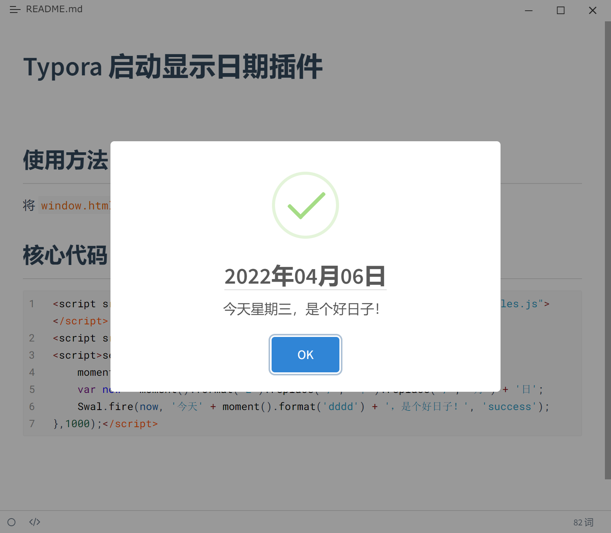

# Typora 启动显示日期插件 

## 使用方法

将 `window.html` 拷贝到 Typora 安装目录的 `resources` 目录下覆盖即可。

## 核心代码

```js
<script src="http://cdn.staticfile.org/moment.js/2.24.0/moment-with-locales.js"></script>
<script src="https://cdn.jsdelivr.net/npm/sweetalert2@8"></script>
<script>setTimeout(function() {
    moment.locale('zh-cn');
    var now = moment().format('L').replace('/', '年').replace('/', '月') + '日';
    Swal.fire(now, '今天' + moment().format('dddd') + '，是个好日子！', 'success');
},1000);</script>
```

## 效果演示

 
